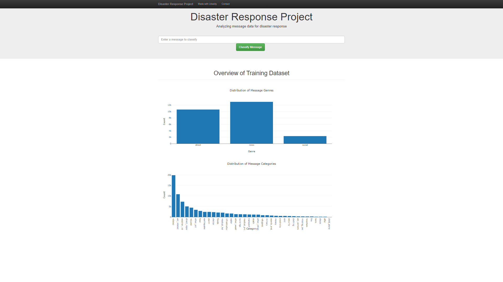
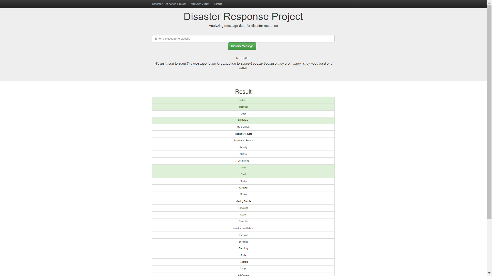

# Disaster Response Pipeline Project

## Summary
The Disaster Response Pipeline Project is designed to significantly improve the efficiency and effectiveness of emergency responders during disaster events. By leveraging machine learning and natural language processing techniques, the application categorizes incoming disaster-related messages into relevant categories. This categorization enables responders to quickly understand the nature of each message and prioritize their actions accordingly.

### Key Benefits:
- **Rapid Response**: The application processes and categorizes messages in real-time, allowing emergency responders to act quickly and efficiently.
- **Enhanced Decision Making**: By organizing messages into specific categories, the application helps responders identify the most critical needs and allocate resources where they are needed the most.
- **Scalability**: The system can handle a large volume of messages, making it suitable for use in large-scale disaster situations where communication influx is high.
- **User-Friendly Interface**: Provides an interactive web interface that is easy for responders to use, ensuring that the technology supports them rather than hinders their efforts.

This project aims to bridge the gap between disaster communication and response, ensuring that help can be provided faster and more effectively during critical times.


## Project Structure
```
├── Pipfile
├── Pipfile.lock
├── README.md
├── app
│   ├── __init__.py
│   ├── run.py
│   └── templates
│       ├── go.html
│       └── master.html
├── assets
│   ├── display_input_text.PNG
│   └── display_model_results.PNG
├── data
│   ├── DisasterResponse.db
│   ├── __init__.py
│   ├── disaster_categories.csv
│   ├── disaster_messages.csv
│   └── process_data.py
├── models
│   ├── __init__.py
│   ├── classifier.pkl
│   └── train_classifier.py
└── notebooks
    ├── ETL Pipeline Preparation.ipynb
    └── ML Pipeline Preparation.ipynb
```

## Key Features
- **Data Cleaning and ETL Pipeline**: Cleans and processes raw disaster messages and categories, storing them in a SQLite database.
- **Machine Learning Pipeline**: Trains and evaluates a multi-output classifier to predict message categories.
- **Web Application**: Provides an interactive web interface for users to input new messages and receive classification results in real-time. The app also displays visualizations of the input data: Distribution of message genres and distribution of message categories.

## Technology Stack
- **Python**: Core programming language for building the ETL and ML pipelines.
- **Pandas**: For data manipulation and analysis.
- **Scikit-learn**: For building and evaluating the machine learning models.
- **Flask**: To create a web application for real-time message classification.
- **SQLite**: For storing processed data.

## Web App



## Instructions:
1. Run the following commands in the project's root directory to set up your database and model.

    - To run ETL pipeline that cleans data and stores in database
        `python data/process_data.py data/disaster_messages.csv data/disaster_categories.csv data/DisasterResponse.db`
    - To run ML pipeline that trains classifier and saves
        `python models/train_classifier.py data/DisasterResponse.db models/classifier.pkl`

2. Run the following command in the app's directory to run your web app.
    `python run.py`

3. Go to http://0.0.0.0:3001/
